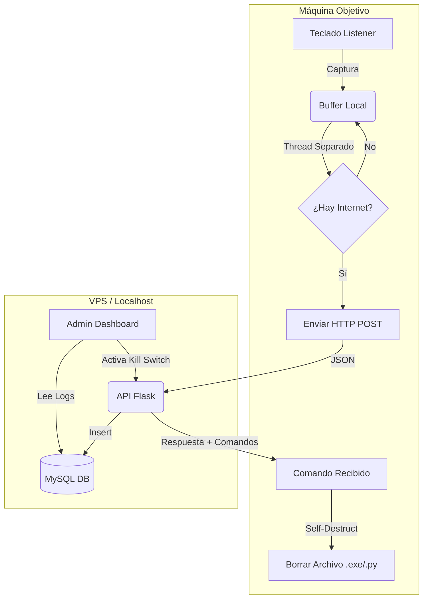

# 🛡️ GhostLogger - Advanced Educational Keylogger


> **⚠️ DISCLAIMER / AVISO LEGAL**
> Este software ha sido desarrollado **exclusivamente con fines educativos y de investigación** en ciberseguridad. El propósito es entender cómo funcionan los mecanismos de registro de eventos y persistencia.
>
> **El autor no se hace responsable del mal uso de este código.** La instalación de keyloggers en ordenadores sin el consentimiento explícito de su propietario es ilegal y está penada por la ley.

---

## 📋 Descripción

**GhostLogger** es un sistema de monitoreo remoto basado en una arquitectura Cliente-Servidor robusta. 

El **Cliente** es un agente ligero escrito en Python que captura pulsaciones de teclado y cambios de ventana activa, gestionando el envío de datos mediante hilos (threading) para evitar bloqueos. Cuenta con almacenamiento en buffer local en caso de desconexión.

El **Servidor** es una API RESTful construida con Flask que recibe los datos, los almacena en MySQL y sirve un **Panel de Control (Dashboard)** en tiempo real con capacidades de comando remoto.

### 🔥 Características Principales

*   **Dashboard Web en Tiempo Real:** Interfaz oscura ("Hacker style") para visualizar logs cómodamente.
*   **Remote Kill Switch (Autodestrucción):** Botón de emergencia en el panel para ordenar al cliente que se elimine a sí mismo y borre sus rastros del disco.
*   **Smart Buffering & Threading:** El cliente no bloquea el teclado al enviar datos. Si no hay internet, guarda los logs y reintenta después.
*   **Window Awareness:** Registra en qué aplicación se escribieron los textos.
*   **Persistencia de Conexión:** El servidor gestiona reconexiones automáticas a la base de datos para evitar caídas (MySQL ping).

---

## 🏗️ Arquitectura del Sistema


## 📂 Estructura del Proyecto

```
keylogger_project/
├── server/
│   ├── app.py              # Servidor API + Dashboard
│   ├── requirements.txt    # Dependencias del servidor (Flask, PyMySQL, etc)
│   └── templates/          # CARPETA OBLIGATORIA para el HTML
│       └── dashboard.html  # Interfaz gráfica del panel
├── client/
│   ├── keylogger.py        # Agente (Cliente)
│   └── requirements.txt    # Dependencias del cliente (requests, pynput)
├── database.sql            # Script de inicialización de la BD
└── README.md               # Este archivo
```
## 🛠️ - [Guía de Despliegue](Guía.md)
