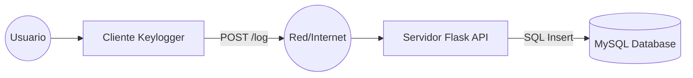

# ⌨️ Educational Remote Keylogger (Client-Server)

> **⚠️ DISCLAIMER / AVISO LEGAL**  
> Este software ha sido desarrollado únicamente con fines **educativos y de investigación** en ciberseguridad. El autor no se hace responsable del mal uso que se le pueda dar. El uso de este software en ordenadores sin el consentimiento explícito de su propietario es ilegal y penado por la ley.

## 📋 Descripción
Este proyecto implementa un sistema de registro de pulsaciones de teclas (Keylogger) basado en una arquitectura Cliente-Servidor.
- **Cliente (Python):** Se ejecuta en la máquina objetivo, captura las teclas y detecta en qué ventana se están escribiendo. Envía los datos vía HTTP.
- **Servidor (Flask):** Recibe los datos y los almacena en una base de datos MySQL.

## 🚀 Arquitectura y Flujo


# 📂 Estructura del Proyecto
```
keylogger_project/
├── server/
│   ├── app.py             # API Flask que recibe los logs
│   └── requirements.txt   # Dependencias del servidor
├── client/
│   ├── keylogger.py       # Script espía (captura teclado)
│   └── requirements.txt   # Dependencias del cliente
└── database.sql           # Script de creación de la base de datos
```

# 🛠️ Guía de Despliegue e Instalación
